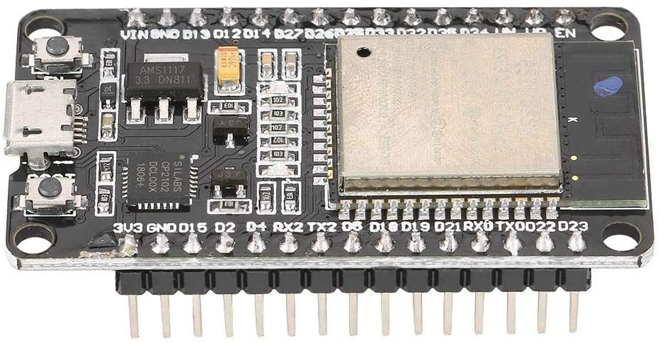
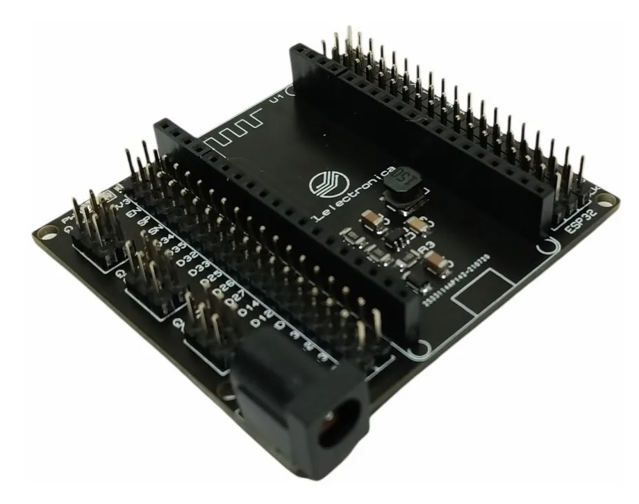
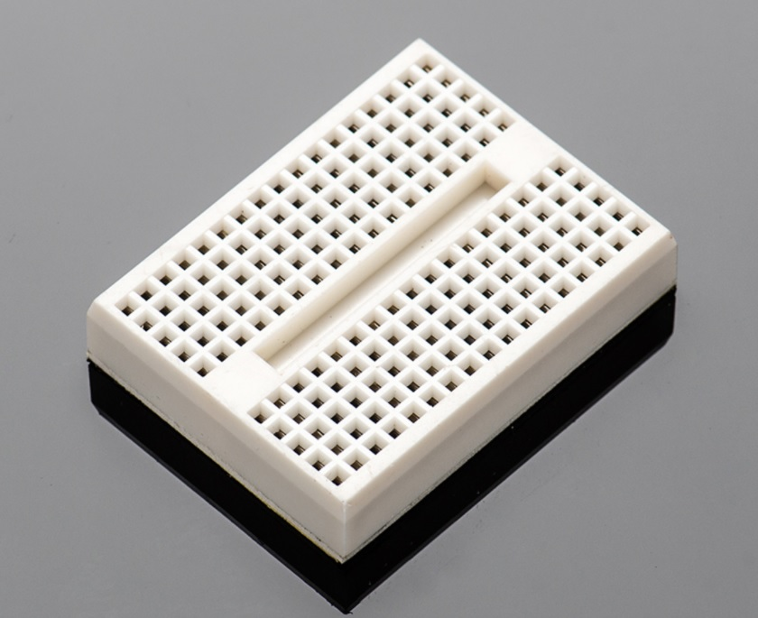
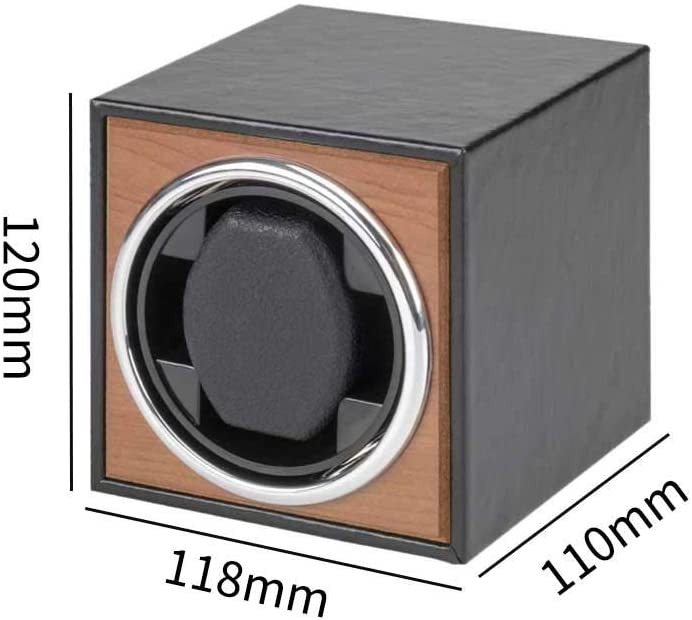
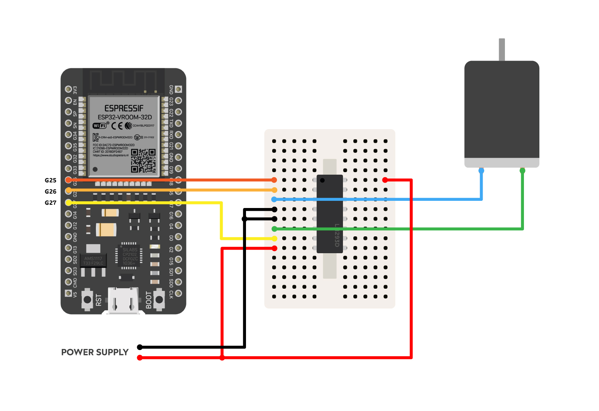
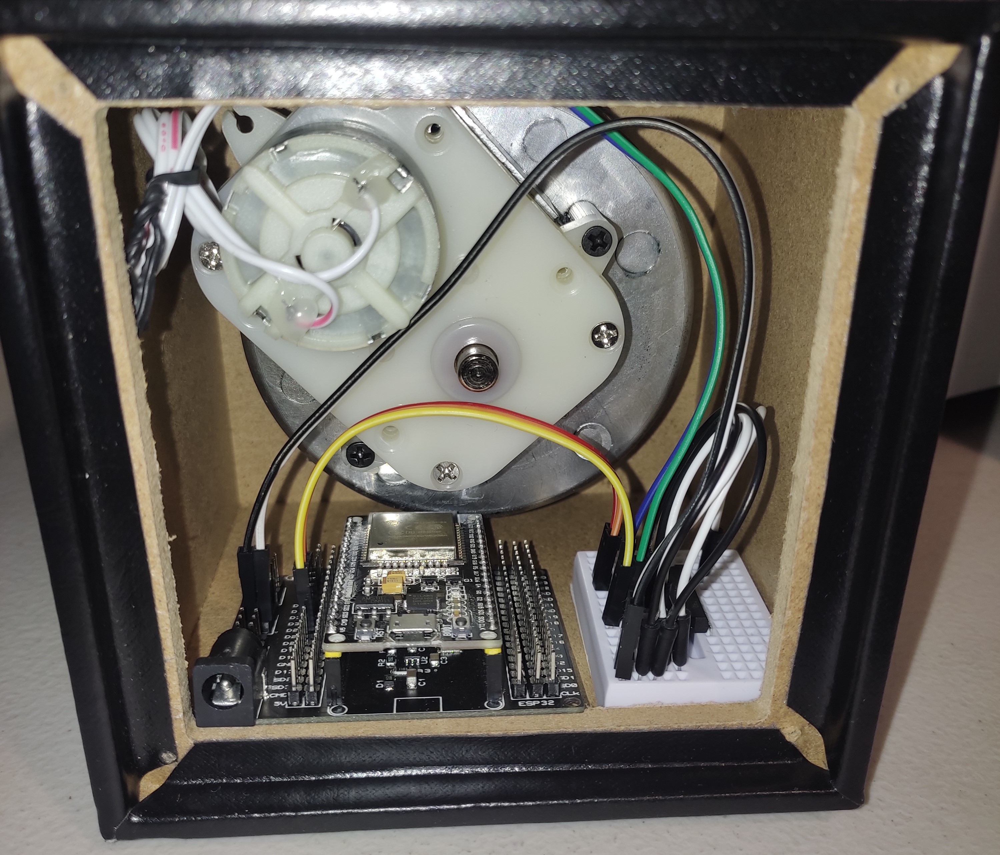

# Smart-Watch-Winder
A free open-source Smart Watch Winder for ESP32 using WebScokets and Nuxt.js

## Setup
```bash
# Websocket server with express
$ cd Server

# Install dependencies
$ npm install

# Start the server
$ npm run start

# Frontend with Nuxt.js
$ cd Frontend

# Install dependencies
$ npm install

# Serve with hot reload at localhost:3000
$ npm run dev
```

## Hardware
- [ ] ESP32
- [ ] ESP32 Base Shield (Optional)
- [ ] DC motor or Stepper motor (Modify the code to use a stepper motor)
- [ ] LN293D (DC motor)
- [ ] Mini breadboard
- [ ] Jumper cables (5/10cm and 15/20 cm)
- [ ] Power supply
- [ ] Cheap Watch Winder Box from Amazon or Aliexpress






## Connections
Connect the ESP32 to the breadboard with the LN293D with the following connections:
- LN293D motorEN1 to pin 25
- LN293D motorIN1A to pin 26
- LN293D motorIN1B to pin 27
- LN293D motorOUT1A to DC Motor IN1
- LN293D motorOUT1B to DC Motor IN2
- LN293D Vin and Vcc to 5v

Make sure the motos is connected right, it should spin Clockwise the first time you run the code.

### Diagram


### My box


## Notes
I recomend the use of a stepper motor for better control, in my case I used the DC motor inside the box as this is easier to manage and I couldn't disassemble the inside part that rotates.